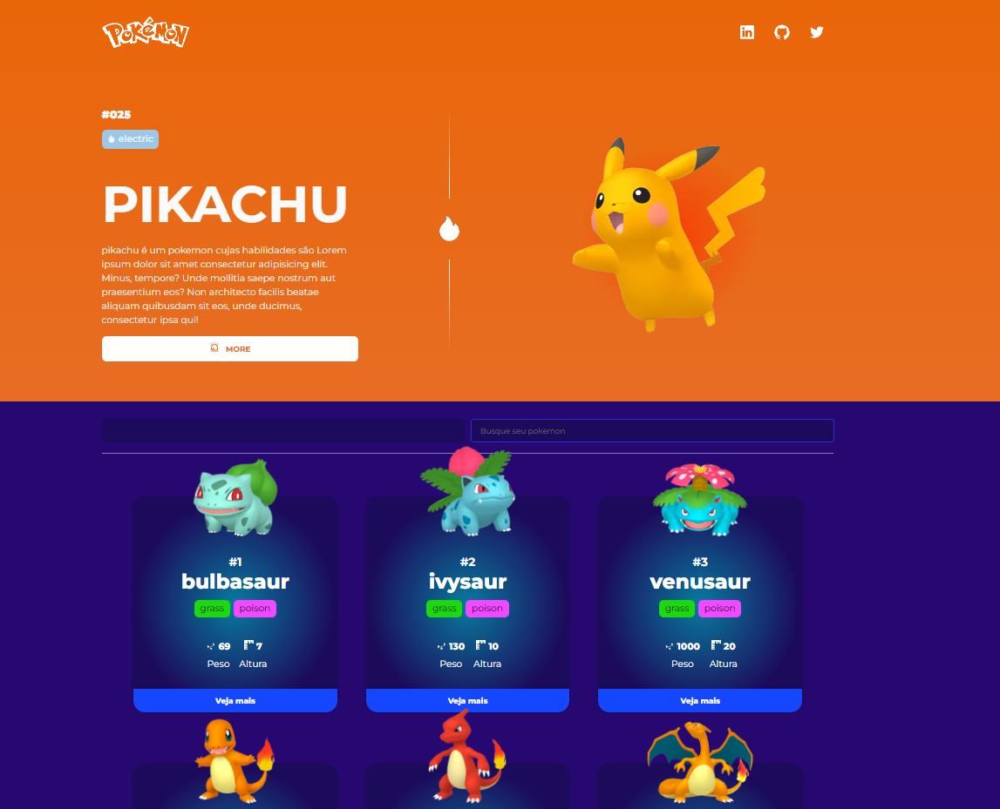

<p align="center"></p>
<p align="center">Pokedex project: pokemon listing, image and attributes of each one</p>
<h1 align="center">
 
  

</br>
</h1>
</br>

## 🛠 Technologies used

</br>

    
 


## 🚀 How to start

To contribute to this project or learn from it is very simple, just clone this repository on your computer and install the necessary dependencies for it to work. Below you can check how to do this, as well as how to run it on a local server.

### 📌 Requirement

> node package manager (NPM or YARN)

> Git bash (optional, you can download the code directly from GitHub at 'code' > 'Download zip')

### ✨ Now are you ready to start 

> clone the repository
```bash
git clone https://github.com/LuciLua/pokedex.git
```

> open project folder
 ```bash
cd ./pokedex
```

> install all packages using npm or yarn manager (using NPM)
```bash
npm i
```

> start the development server (using NPM)
```bash
npm run dev
```

### 🏗 Build 

> to make a build (using NPM)
```bash
npm run build
```

> to start the server in production-ready mode (using NPM)
```bash
npm run start
```


## 🖼 Preview

**So far, this is the preview, but you can check it out at [this updated link](https://pokedex-of-luci.vercel.app/)**


