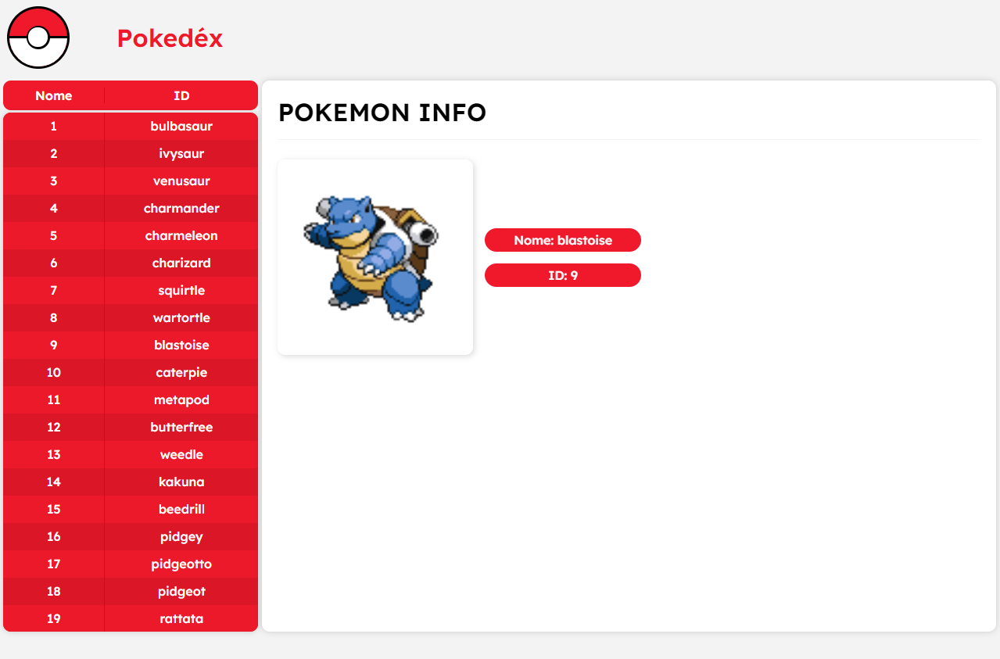

<h1 align="center">Pokedéx</h1>

Pokedex project: pokemon listing, image and attributes of each one

<h1 align="center">
 
 
</h1>

## 🛠 Technologies used

    
 

 

## 🚀 How to start

Pokedex project: pokemon listing, image and attributes of each one

### 📌 Requirement

> node package manager (NPM or YARN)

### ✨ Now are you ready to start 

> clone the repository
<code> git clone https://github.com/LuciLua/pokedex.git</code>

> open project folder
<code> cd ./pokedex</code>

> install all packages using npm or yarn manager (using NPM)
<code> npm i </code>

> start the development server (using NPM)
<code> npm run dev </code>

### 🏗 Build 

> to make a build (using NPM)
<code> npm run build </code>

> to start the server in production-ready mode (using NPM)
<code> npm run start </code>

## 🖼 Preview

**So far, this is the preview, but you can check it out at [this updated link](https://pokedex-of-luci.vercel.app/)**

